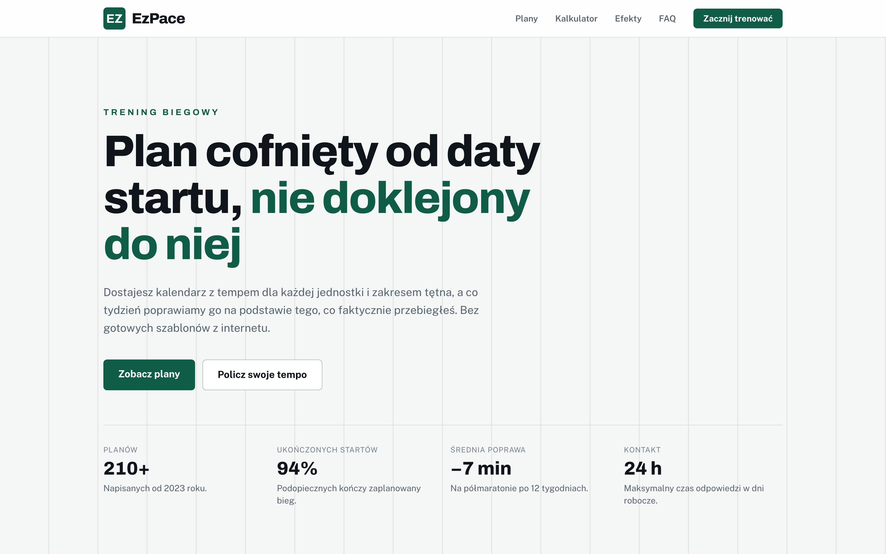
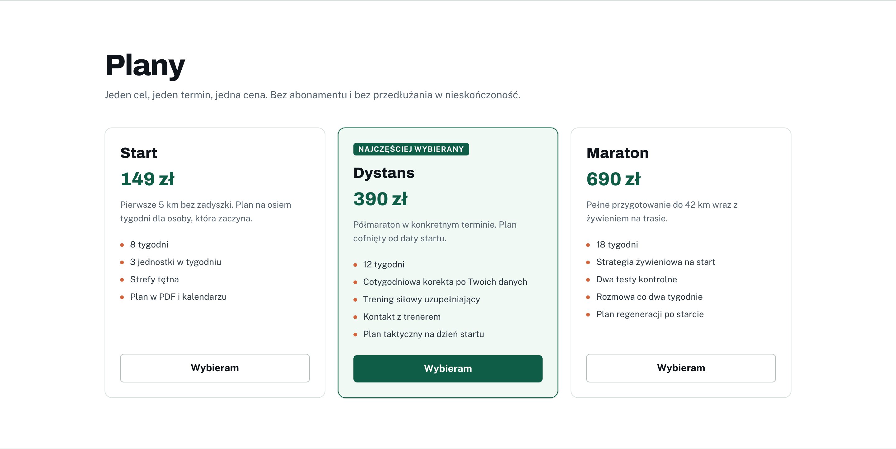
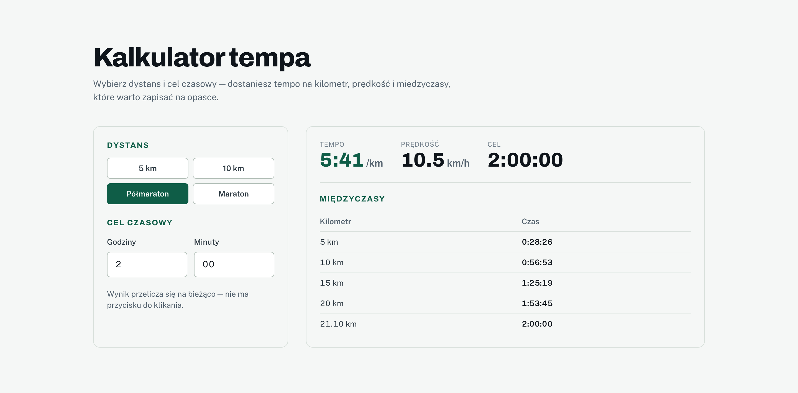
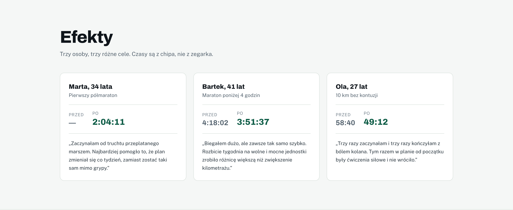

# EzPace

> 🏃 **A plan counted back from the race date, not bolted onto it** — running coaching with a working pace calculator and a weekly correction loop

**EzPace** is a product site for a running coach. Three plans, a calculator that actually computes, the coaching process and real-looking results. The premise is that a training plan is derived from the race date rather than appended to it, and every section on the page argues that point.

There is no backend and no database. The site is prerendered to files and served by GitHub Pages; the calculator runs entirely in the browser.

[](https://github.com/dawidolko/EzPace-Platform-NextJS/actions/workflows/deploy.yml)


**Live:** [ezpace.dawidolko.pl](https://ezpace.dawidolko.pl)

---

## 🎯 Key Features

- **A pace calculator that is not a mock-up** — pick a distance and a target time, get pace per kilometre, speed and the full split table, recalculated as you type.
- **Splits that include the leftover distance** — dropping the final 0.0975 km of a half marathon reports a finish about fifteen seconds early, which is exactly the error a runner notices on the course.
- **Three plans, one price each** — no subscription, no open-ended extension; each states its length and what the weekly correction covers.
- **Results with real numbers** — before and after times taken from the chip, not the watch.
- **CSS-only FAQ** — `<details>` and `<summary>`, no JavaScript required.

---

## 🖼️ Screenshots

| Hero — the premise in one screen                                          | Training plans                                                    |
| ---------------------------------------------------------------------------- | -------------------------------------------------------------------- |
|  |  |

| Pace calculator                                                                     | Results                                                          |
| -------------------------------------------------------------------------------------- | ------------------------------------------------------------------- |
|  |  |

---

## 🧮 The Pace Calculator

`src/components/KalkulatorTempa.tsx` derives everything from two inputs: the distance and the target time.

- **Pace** is the target time divided by the distance, formatted as `m:ss`.
- **Speed** is the distance over the time in hours.
- **Splits** land on whole kilometres plus the leftover distance, so the final row always equals the stated goal.

Verified against independent arithmetic: a 2:00 half marathon gives **5:41/km at 10.5 km/h**; a 4:30 marathon gives **6:24/km at 9.4 km/h**.

---

## 🧩 Application Layer

| Layer            | Responsibility                                                                                 |
| ---------------- | ------------------------------------------------------------------------------------------------ |
| `src/app`        | Routing, document metadata, fonts, JSON-LD and the page itself. One route, fully prerendered.    |
| `src/components/KalkulatorTempa.tsx` | The only stateful component: distance and target time in, pace and splits out.     |
| `src/components/dane.ts` | All copy: plans, process steps, figures, runner stories and FAQ entries.                 |
| `src/app/globals.css`    | Design tokens and base styles. Components read tokens; no component hard-codes a hex value. |

---

## 🛠️ Technology Stack

### Frontend

| Technology   | Version | Role                                            |
| ------------ | ------- | ----------------------------------------------- |
| Next.js      | 16      | App Router with `output: 'export'`               |
| React        | 19      | Component model                                  |
| TypeScript   | 5       | Strict mode, no implicit `any`                   |
| Tailwind CSS | 4       | Utility layer on top of a token theme            |

### Infrastructure

| Technology     | Role                                             |
| -------------- | ------------------------------------------------ |
| GitHub Actions | Typecheck, build and export verification         |
| GitHub Pages   | Static hosting behind a custom domain            |

---

## 🚀 Getting Started

### Prerequisites

- Node.js 20 or newer
- npm 10 or newer

### 1. Clone the Repository

```bash
git clone https://github.com/dawidolko/EzPace-Platform-NextJS.git
cd EzPace-Platform-NextJS
```

### 2. Install Dependencies

```bash
npm install
```

### 3. Run

```bash
npm run dev        # http://localhost:3000
npm run verify     # typecheck + production build
npm run serve      # serve the exported site from out/
```

---

## 🎨 Design

Morning on the trail: a light, cool ground, deep pine as the lead colour and warm clay reserved for small accents — deliberately the inverse of its sibling project **EzScout**, which is nocturnal and amber. The kilometre-marker motif behind the hero is a repeating CSS gradient, so it costs no network request.

---

## ♿ Accessibility

- One `<h1>` per page, no skipped heading levels.
- Skip link as the first focusable element, `<main id="main-content">` as its target.
- Calculator results announced through `aria-live`, so a screen-reader user hears the new pace as the inputs change.
- The split table carries a `<caption>` and `scope` on every header cell.
- Distance selection is a real radio group inside a `<fieldset>` with a `<legend>`, operable from the keyboard.
- `prefers-reduced-motion` honoured across every transition.

---

## 📁 Project Structure

```
src/
├── app/
│   ├── layout.tsx            metadata, fonts, JSON-LD, landmarks
│   ├── page.tsx              every section of the page
│   └── globals.css           design tokens and base styles
└── components/
    ├── dane.ts               plans, process, figures, stories, FAQ
    ├── KalkulatorTempa.tsx   pace, speed and split calculation
    ├── SiteHeader.tsx        sticky navigation with a mobile menu
    └── SiteFooter.tsx
```

---

## 📄 License

MIT — see [LICENSE](LICENSE).
